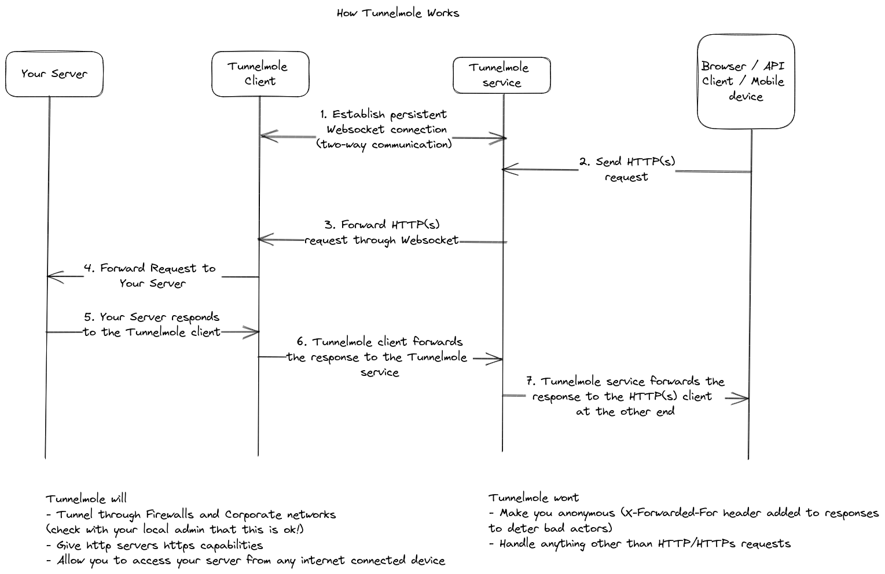

### Serve Public
Serve any folder on your device with a Public URL.

You can share a folder, or serve up a static file website such as an SPA or React app.

If you want to share an actual server running locally instead such as a PHP/NodeJS site or an API, try [Tunnelmole](https://github.com/robbie-cahill/tunnelmole-client).


#### Prerequisites
The only real external dependency is NodeJS 14+. Everything else will be taken care of by `npm`.

#### Installation
Once you have NodeJS installed, to install `serve-public` run the following.
```
npm install -g serve-public
```

#### Usage
Get a Public URL for any folder on your device, simply run the following
```
serve-public --path </path/to/your/folder>
```

If you are sharing a website, ensure you have a `index.html` file in your folder. Or, navigate manually to your HTML page.

You'll see output like
```
Local server listening on http://localhost:3000 # This is the port the server is listening to on localhost
http://cnrsqd-ip-157-211-241-249.tunnelmole.com is forwarding to localhost:3000 # A public, plain HTTP url for your folder
https://cnrsqd-ip-157-211-241-249.tunnelmole.com is forwarding to localhost:3000 # A public HTTPS url for your folder
```

These URLs are random and will be regenerated each time you launch `serve-public`.


#### Getting a custom subdomain, or a domain that does not change
Custom subdomains that do not change require a paid subscription from [Tunnelmole](https://dashboard.tunnelmole.com?utm_source=servePublicGithub), or self hosting your own [Tunnelmole Service](https://github.com/robbie-cahill/tunnelmole-service/).

Once that is out of the way, run the following
`serve-public --path </path/to/your/folder> --domain mysite.tunnelmole.com`

You'll see output like
```
Local server listening on http://localhost:3000
http://mysite.tunnelmole.com is forwarding to localhost:3000
https://mysite.tunnelmole.com is forwarding to localhost:3000
```

#### How it works
`serve-public` uses [Tunnelmole](https://github.com/robbie-cahill/tunnelmole-client) under the hood to get the Public URLs. It then starts a simple [Express](https://expressjs.com/) server with a couple of middlewares that serve up static files and folder listings.

When you hit the public URL, the request is forwarded through the tunnelmole servers to your local client, then to the express server serving up your folder. If that was a bit of a mouthful, heres a diagram:



#### License
The code is MIT licensed, you can go ahead and use this in your own projects both open source and commercial.

#### Contributing
This is a community project and contributions are welcome. See our document on [Contributing](CONTRIBUTING.md) for more info.